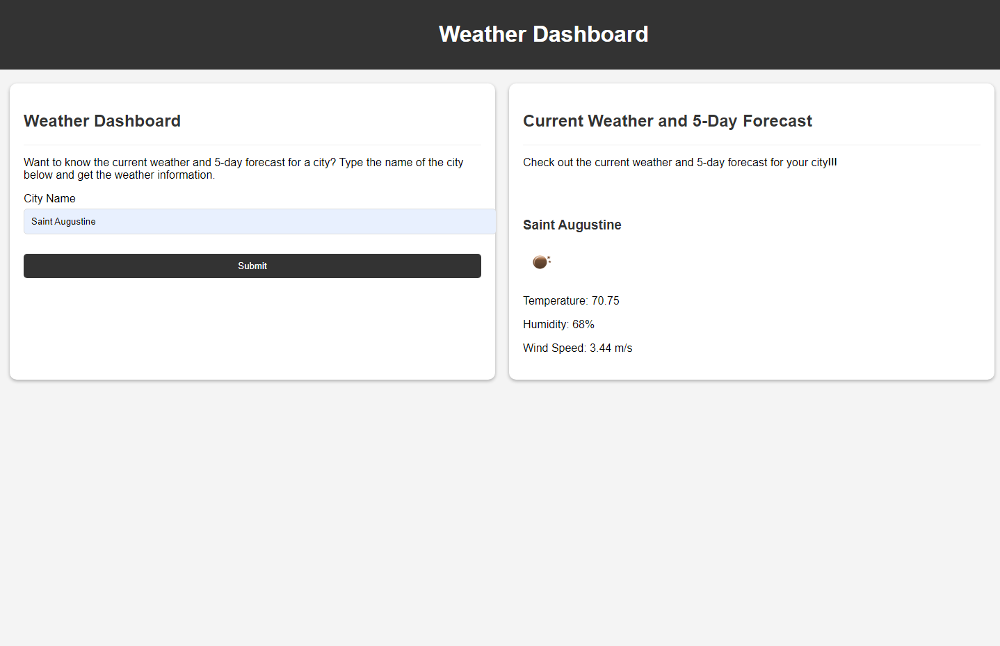

# Weather Dashboard

This application is a weather dashboard that allows you to search for a city and view both current and future weather conditions for that city. The city is also added to the search history for easy access in the future.

## Features

1. **City Search**: When you search for a city, you are presented with current and future weather conditions for that city. The city is also added to the search history.

2. **Current Weather Conditions**: When you view the current weather conditions for a city, you are presented with the following information:
   - City name
   - Date
   - An icon representation of the weather conditions
   - Temperature
   - Humidity
   - Wind speed

3. **Future Weather Conditions**: When you view the future weather conditions for a city, you are presented with a 5-day forecast. Each day in the forecast includes the following information:
   - Date
   - An icon representation of the weather conditions
   - Temperature
   - Wind speed
   - Humidity

4. **Search History**: When you click on a city in the search history, you are again presented with current and future weather conditions for that city.

## Usage

To use the weather dashboard, simply enter the name of the city you want to search for in the search bar and press enter. The current and future weather conditions for that city will be displayed on the screen. The city will also be added to the search history, which you can access by clicking on the city name in the history list.

## Technologies Used

- HTML
- CSS
- JavaScript
- OpenWeatherMap API

